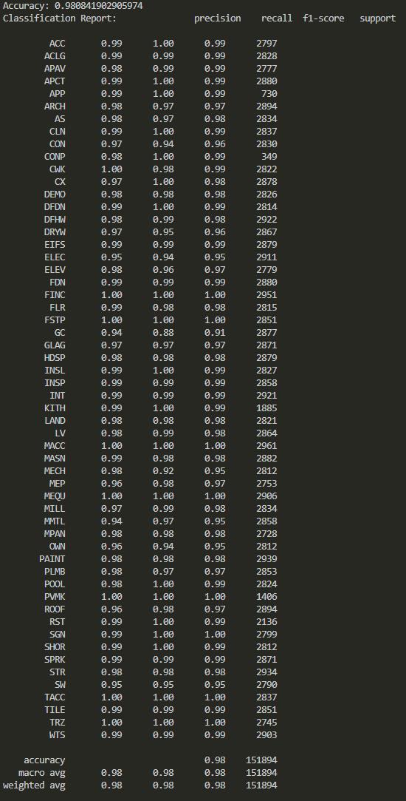

# Construction Schedule Subcontractor Trade ML Classification System

## Project Background
Schedulers at Brasfield & Gorrie, a **$7B+** General Contractor in the Southeast US, faced a significant challenge in assigning trade contractors to schedule activities—a task that required analyzing thousands of activities weekly and manually assigning trade labels. This process was time-intensive, prone to human error, diverted attention from higher-value scheduling tasks, and many times did not get done.

To address this, I developed a machine learning solution that automates the classification of scheduling activities by trade contractor. The final proposed solution leverages supervised learning through a Random Forest Classifier. The model was trained on **514K+** records and achieves **98%** accuracy, ensuring reliable trade assignments with minimal effort.

Key client needs addressed:

Efficiency: Eliminated the **1.5-hour** weekly manual process per project scheduler.
Accuracy: Reduced errors by leveraging a robust machine learning model that meets a minimum of 80% model accuracy in order to match the current accuracy by Schedulers.
Scalability: Enabled the processing of thousands of schedule activities in seconds, making it suitable for large-scale projects.
The solution integrates seamlessly into existing workflows via a Vue.js-powered web app, allowing schedulers to upload Excel schedules exported from Primavera P6 scheduling software and receive trade-labeled outputs instantly. This innovation not only saves over **3,000** man-hours annually but also enables the data to be used for other purposes such as: Monte-Carlo Risk Simulations, ability to analyze Sub-Contractor's performance, create historical durations, and lay the foundations for automating professional construction schedule generation with AI.

## Tools & Technologies:
- **Python**: Pandas, numpy, Scikit-Learn, NLTK, re
- **ML File Handling**: pickle, h5
- **DataBricks SQL**: Cloud Data Storage
- **FastAPI**: Back-end deployment
- **Vue.js**: Front-end
- **Docker**: Containerization

## Data
The dataset includes 514K records of construction scheduling activities in every market vertical (Hospitals, Infrastructure, Apartments, Multi-Family, Data Centers, Office Buildings, etc.). Data was sourced from the clients proprietary data set of commercial construction projects all over the US via python's DataBrick SQL connector.
- **Activity Name**: Text describing the work being done.
- **WBS Name**: Text describing the Work Breakdown Structure.
- **Trade Label**: The assigned sub-contractor scope of work (Electrical, Mechanical, etc.) (target variable). There were 56 classes of trade responsibilities.

## Sample Data Output
For the full python script used to access the data via Databricks see this [Fetch Data Notebook](Scripts/ETL/fetch_data.ipynb.

Here is a preview of the data output generated during the ETL process:

| ProjectObjectID | ActivityObjectID | ActivityCode | ActivityName                  | WbsobjectID | Name               | MergedActivityCodeValue | ActivityCodeDescription | ActivityCodeTypeName    | ActivityCodeTypeScope | UpdateDate | IngestedDateTime     | rn |
|------------------|------------------|--------------|-------------------------------|-------------|--------------------|--------------------------|--------------------------|-------------------------|-----------------------|------------|----------------------|----|
| 101              | 1001            | CON          | Pour Concrete Foundation      | 201         | Foundation         | CON                      | Concrete                | Trade Responsibility    | AS_Global          | 2024-03-10 | 2025-01-15 08:05:00 | 1  |
| 102              | 1002            | ELEC         | Install Electrical Conduit    | 202         | Level 2            | ELEC                     | Electrical              | Trade Responsibility    | AS_Global          | 2022-01-12 | 2025-01-15 08:05:00 | 1  |
| 103              | 1003            | PAINT        | Apply Paint to Walls          | 203         | Interior Finishes  | PAINT                    | Paint                   | Trade Responsibility    | AS_Project          | 2023-07-24 | 2025-01-15 08:05:00 | 1  |
| 104              | 1004            | ARCH         | Review Architectural Plans    | 204         | Design             | ARCH                     | Architectural Review    | Trade Responsibility    | AS_EPS               | 2024-02-13 | 2025-01-15 08:05:00 | 1  |
| 105              | 1005            | GC           | General Contractor Supervision| 205         | Management         | GC                       | General Contractor      | Trade Responsibility    | AS_Global          | 2018-06-05 | 2025-01-15 08:05:00 | 1  |
| 106              | 1006            | CON          | Lay Concrete Driveway         | 206         | Sitework           | CON                      | Concrete                | Trade Responsibility    | AS_Project          | 2024-03-11 | 2025-01-15 08:10:00 | 2  |

## Modeling Process

The machine learning model was developed using a supervised learning approach with a **Random Forest Classifier**. The following steps were involved:

1. **Preprocessing**:
   - Text fields (`ActivityName`, `WBS Name`, `combined`) were cleaned and transformed using custom preprocessing scripts.
   - Target labels (`Trade Label`) were encoded into numeric values using `LabelEncoder`.

2. **Model Training**:
   - A Random Forest Classifier was selected for its robust performance and ability to handle high-dimensional data.
   - Hyperparameters were tuned to optimize performance, with key settings including:
     - `n_estimators`: 200
     - `class_weight`: 'balanced'

3. **Performance**:
   - The model achieved an accuracy of **98%** on the test set.
   - Detailed performance metrics are shown in the classification report below:

For the full Python script used to train the model, see this [Training Script](Scripts/Modeling/train_model.py).

